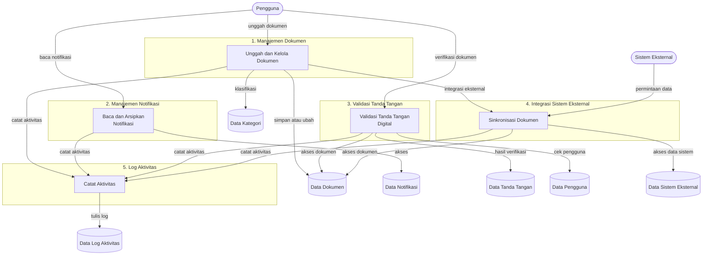

```mermaid
flowchart TD
    Pengguna([Pengguna])
    SistemEksternal([Sistem Eksternal])

    subgraph P1 [1. Manajemen Dokumen]
        Upload[Unggah dan Kelola Dokumen]
    end

    subgraph P2 [2. Manajemen Notifikasi]
        BacaNotif[Baca dan Arsipkan<br>Notifikasi]
    end

    subgraph P3 [3. Validasi Tanda Tangan]
        TTD[Validasi Tanda Tangan<br>Digital]
    end

    subgraph P4 [4. Integrasi Sistem Eksternal]
        Integrasi[Sinkronisasi Dokumen]
    end

    subgraph P5 [5. Log Aktivitas]
        Log[Catat Aktivitas]
    end

    Dokumen[(Data Dokumen)]
    Kategori[(Data Kategori)]
    Notifikasi[(Data Notifikasi)]
    TandaTangan[(Data Tanda Tangan)]
    LogAktivitas[(Data Log Aktivitas)]
    DataPengguna[(Data Pengguna)]
    SistemEksternalDB[(Data Sistem Eksternal)]

    Pengguna -->|unggah dokumen| Upload
    Upload -->|simpan atau ubah| Dokumen
    Upload -->|klasifikasi| Kategori
    Upload -->|catat aktivitas| Log
    Upload -->|integrasi eksternal| Integrasi

    Pengguna -->|baca notifikasi| BacaNotif
    BacaNotif -->|akses| Notifikasi
    BacaNotif -->|catat aktivitas| Log

    Pengguna -->|verifikasi dokumen| TTD
    TTD -->|akses dokumen| Dokumen
    TTD -->|cek pengguna| DataPengguna
    TTD -->|hasil verifikasi| TandaTangan
    TTD -->|catat aktivitas| Log

    SistemEksternal -->|permintaan data| Integrasi
    Integrasi -->|akses data sistem| SistemEksternalDB
    Integrasi -->|akses dokumen| Dokumen
    Integrasi -->|catat aktivitas| Log

    Log -->|tulis log| LogAktivitas
```